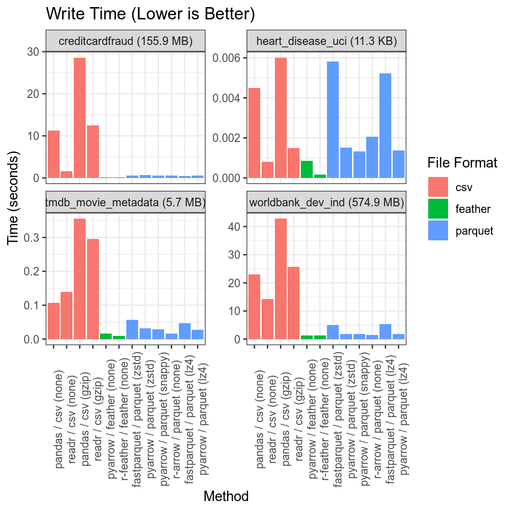
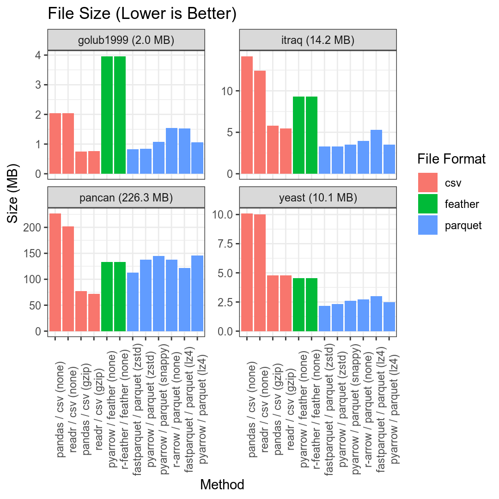
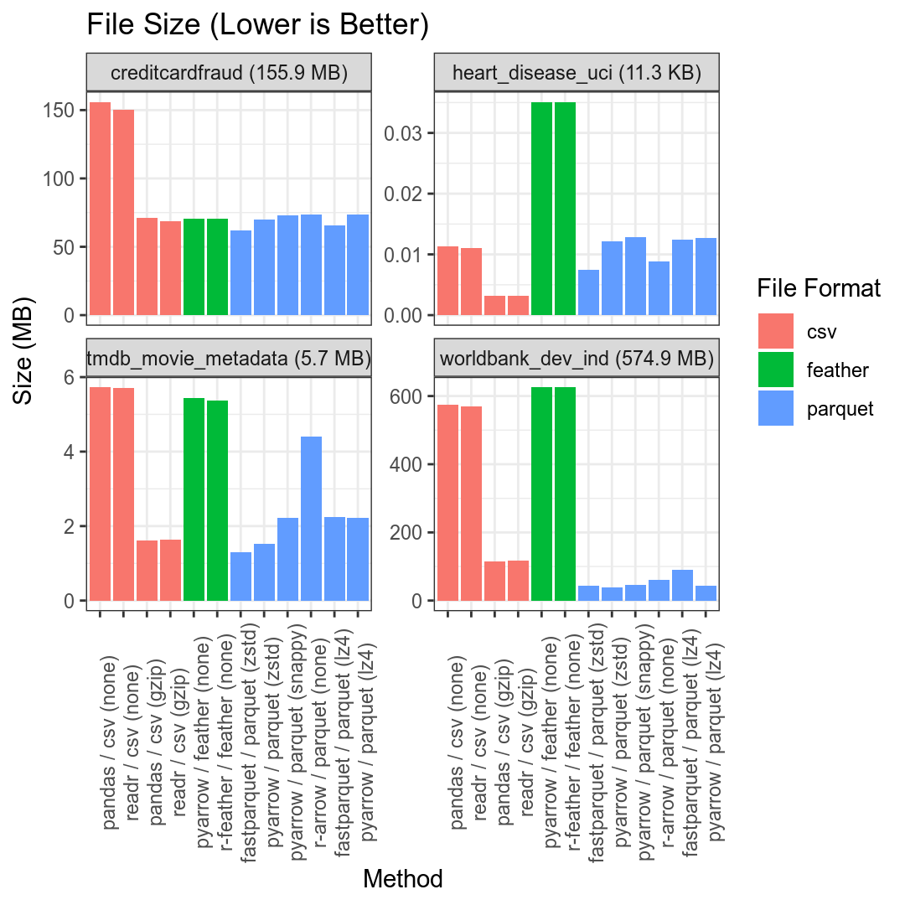

R/Python Data Compression Benchmark
===================================

## Overview

This repository contains a basic pipeline for benchmarking the size and speed efficiency
of several approaches for storing tabular data in R/Python.

## Methods

- csv
  - uncompressed
  - gzip-compressed
- feather
- parquet
  - r-arrow
  - pyarrow
  - fastparquet

For parquet / hdf5, the following compressors will be tested:

- lz4
- snappy
- zstd

Methods to include in the future:

- hdf5 (h5py / rhdf)

## Data

The benchmark results below are for the following [Kaggle Datasets](https://www.kaggle.com/datasets):

- [Gene expression dataset (Golub et al.)](https://www.kaggle.com/crawford/gene-expression) (1.9 MB)
- [Transcriptomics in Yeast (Unpublished)](https://www.kaggle.com/costalaether/yeast-transcriptomics) (9.6 MB)
- [iTRAQ breast cancer proteome profiling data](https://www.kaggle.com/piotrgrabo/breastcancerproteomes) (11.8 MB)
- [PANCAN TCGA Pan-cancer Gene Expression Data](https://www.kaggle.com/murats/gene-expression-cancer-rnaseq) (196.6 MB)
- [Credit card fraud detection](https://www.kaggle.com/mlg-ulb/creditcardfraud#creditcard.csv) (144 MB)
- [Heart Disease UCI](https://www.kaggle.com/ronitf/heart-disease-uci) (11 KB)
- [World Development Indicators](https://www.kaggle.com/worldbank/world-development-indicators#Indicators.csv) (547.7 MB)
- [TMBB 5000 Movies](https://www.kaggle.com/tmdb/tmdb-movie-metadata#tmdb_5000_movies.csv) (5.43 MB)


The first four datasets were chosen because they are all generally of a similar nature
to the data I work with the most ([omics data](https://en.wikipedia.org/wiki/Omics)),
and because they encompass a range of different file sizes.

The later four datatypes were chosen to give an indication of possible performance for
other diverse datatypes and include things like credit card fraudulence, movie metadata,
and world bank development indicators.

The benchmark can be configured to operate on a different set of Kaggle datasets by
editing the `datasets` portion of `config.yml` and specfiying the Kaggle dataset ids
and filenames for the desired datasets.

## Usage

To run the benchmark pipeline, simply create a clone of the repo, edit the
configuration file (`config.yml`) to your liking.

In order to access datasets via the [Kaggle API](https://github.com/Kaggle/kaggle-api), you must have an account and [request an
API token](https://www.kaggle.com/search).

These can then be stored and sourced from any file loaded during your shell
initialization (e.g.`~/.zshrc`):

```sh
export KAGGLE_USERNAME=<username>
export KAGGLE_KEY=<api key>
```

Next, create a conda environment and run the pipeline using the following commands:

```sh
conda create -n benchmark-compression --file requirements.txt
conda activate benchmark-compression
snakemake --configfile config.yml -j<num_threads>
```

Where `<num_threads>` is the number of threads you want to allow
[snakemake](https://snakemake.readthedocs.io/en/stable/) to use when
executing the pipline.

## Results







## System specs

- Arch Linux 64-bit (5.4.6)
- AMD Ryzen Threadripper 1950X 16-Core Processor
- 128G DDR4-2666 Mhz memory

## See Also

- [Columnar File Performance Check-in for Python and R: Parquet, Feather, and FST](https://ursalabs.org/blog/2019-10-columnar-perf/)
- [Feather, CSV, or Rdata](https://github.com/vsbuffalo/devnotes/wiki/Feather,-CSV,-or-Rdata)
- [The Best Format to Save Pandas Data](https://towardsdatascience.com/the-best-format-to-save-pandas-data-414dca023e0d)
- [Feather Performance Analysis](https://rstudio-pubs-static.s3.amazonaws.com/186749_6885de9a0c5e4865bfa7560593c61621.html)
- [Development update: High speed Apache Parquet in Python with Apache Arrow ](https://wesmckinney.com/blog/python-parquet-update/)
- [Pandas I/O Benchmarking](https://medium.com/@black_swan/pandas-i-o-benchmarking-56cd688f832b)
