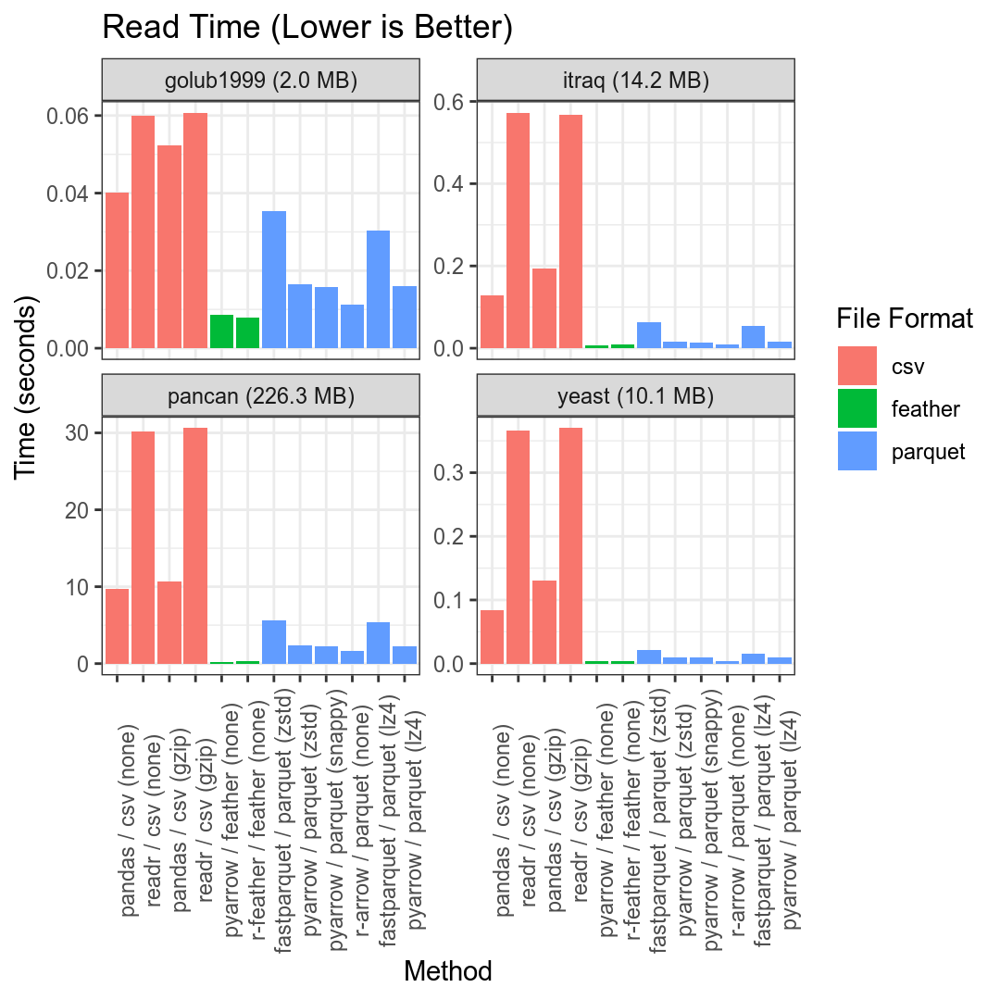
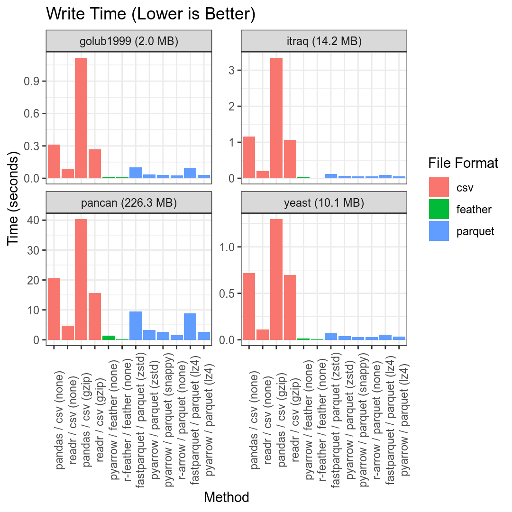
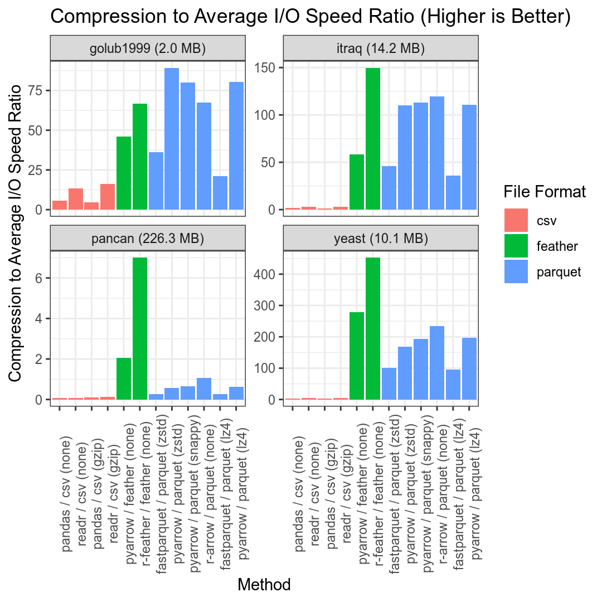

R/Python Data Compression Benchmark
===================================

## Overview

This repository contains a basic pipeline for benchmarking the size and speed efficiency
of several approaches for storing tabular data in R/Python.

## Methods

- csv
  - uncompressed
  - gzip-compressed
- feather
- parquet
  - pyarrow
  - fastparquet

For parquet / hdf5, the following compressors will be tested:

- lz4
- snappy
- zstd

Methods to include in the future:

- r / parquet ([arrow](https://arrow.apache.org/blog/2019/08/08/r-package-on-cran/))
- hdf5 (h5py / rhdf)

## Data

The benchmark results below are for the following [Kaggle Datasets](https://www.kaggle.com/datasets):

- [Gene expression dataset (Golub et al.)](https://www.kaggle.com/crawford/gene-expression) (1.9 MB)
- [Transcriptomics in Yeast (Unpublished)](https://www.kaggle.com/costalaether/yeast-transcriptomics) (9.6 MB)
- [iTRAQ breast cancer proteome profiling data](https://www.kaggle.com/piotrgrabo/breastcancerproteomes) (11.8 MB)
- [PANCAN TCGA Pan-cancer Gene Expression Data](https://www.kaggle.com/murats/gene-expression-cancer-rnaseq) (196.6 MB)

These datasets were chosen because they are all generally of a similar nature to the data
I work with the most ([omics data](https://en.wikipedia.org/wiki/Omics)), and because
they encompass a range of different file sizes.

The benchmark can be configured to operate on a different set of Kaggle datasets by
editing the `datasets` portion of `config.yml` and specfiying the Kaggle dataset ids
and filenames for the desired datasets.

## Usage

To run the benchmark pipeline, simply create a clone of the repo, edit the
configuration file (`config.yml`) to your liking.

In order to access datasets via the [Kaggle API](https://github.com/Kaggle/kaggle-api), you must have an account and [request an
API token](https://www.kaggle.com/search).

These can then be stored and sourced from any file loaded during your shell
initialization (e.g.`~/.zshrc`):

```sh
export KAGGLE_USERNAME=<username>
export KAGGLE_KEY=<api key>
```

Next, create a conda environment and run the pipeline using the following commands:

```sh
conda create -n benchmark-compression --file requirements.txt
conda activate benchmark-compression
snakemake --configfile config.yml -j<num_threads>
```

Where `<num_threads>` is the number of threads you want to allow
[snakemake](https://snakemake.readthedocs.io/en/stable/) to use when
executing the pipline.

## Results

|Dataset   |Method             | Read Time (Secs)| Write Time (Secs)| File Size (MB)| natural_size| Compression Ratio| Compression to I/O Ratio|
|:---------|:------------------|----------------:|-----------------:|--------------:|------------:|-----------------:|------------------------:|
|itraq     |pandas (none)      |             0.12|              1.13|          14.23|        14.23|              1.00|                     1.60|
|golub1999 |pandas (none)      |             0.04|              0.31|           2.07|         2.07|              1.00|                     5.77|
|pancan    |pandas (none)      |             9.48|             20.71|         226.34|       226.34|              1.00|                     0.07|
|yeast     |pandas (none)      |             0.08|              0.71|          10.10|        10.10|              1.00|                     2.52|
|itraq     |pandas (gzip)      |             0.19|              3.27|           5.84|        14.23|              2.43|                     1.41|
|golub1999 |pandas (gzip)      |             0.05|              1.08|           0.76|         2.07|              2.72|                     4.79|
|pancan    |pandas (gzip)      |            10.52|             39.12|          76.82|       226.34|              2.95|                     0.12|
|yeast     |pandas (gzip)      |             0.13|              1.27|           4.82|        10.10|              2.10|                     2.99|
|itraq     |feather (none)     |             0.01|              0.04|           9.30|        14.23|              1.53|                    67.60|
|golub1999 |feather (none)     |             0.01|              0.01|           3.96|         2.07|              0.52|                    47.52|
|pancan    |feather (none)     |             0.22|              1.42|         133.13|       226.34|              1.70|                     2.08|
|yeast     |feather (none)     |             0.00|              0.01|           4.54|        10.10|              2.22|                   349.88|
|itraq     |pyarrow (lz4)      |             0.01|              0.06|           3.50|        14.23|              4.07|                   113.56|
|golub1999 |pyarrow (lz4)      |             0.02|              0.03|           1.07|         2.07|              1.94|                    82.04|
|pancan    |pyarrow (lz4)      |             2.17|              2.62|         145.48|       226.34|              1.56|                     0.65|
|yeast     |pyarrow (lz4)      |             0.01|              0.03|           2.47|        10.10|              4.10|                   206.91|
|itraq     |fastparquet (lz4)  |             0.06|              0.09|           5.31|        14.23|              2.68|                    36.10|
|golub1999 |fastparquet (lz4)  |             0.03|              0.09|           1.53|         2.07|              1.35|                    22.47|
|pancan    |fastparquet (lz4)  |             5.33|              8.66|         121.36|       226.34|              1.87|                     0.27|
|yeast     |fastparquet (lz4)  |             0.02|              0.05|           3.01|        10.10|              3.36|                    95.87|
|itraq     |pyarrow (snappy)   |             0.01|              0.06|           3.49|        14.23|              4.07|                   115.28|
|golub1999 |pyarrow (snappy)   |             0.02|              0.03|           1.07|         2.07|              1.94|                    82.39|
|pancan    |pyarrow (snappy)   |             2.26|              2.64|         145.09|       226.34|              1.56|                     0.64|
|yeast     |pyarrow (snappy)   |             0.01|              0.03|           2.61|        10.10|              3.87|                   202.20|
|itraq     |pyarrow (zstd)     |             0.01|              0.06|           3.30|        14.23|              4.31|                   110.34|
|golub1999 |pyarrow (zstd)     |             0.02|              0.03|           0.85|         2.07|              2.45|                    96.35|
|pancan    |pyarrow (zstd)     |             2.18|              3.33|         137.31|       226.34|              1.65|                     0.60|
|yeast     |pyarrow (zstd)     |             0.01|              0.04|           2.34|        10.10|              4.32|                   174.61|
|itraq     |fastparquet (zstd) |             0.06|              0.11|           3.29|        14.23|              4.32|                    49.66|
|golub1999 |fastparquet (zstd) |             0.03|              0.10|           0.83|         2.07|              2.50|                    36.87|
|pancan    |fastparquet (zstd) |             5.60|              9.16|         112.67|       226.34|              2.01|                     0.27|
|yeast     |fastparquet (zstd) |             0.02|              0.07|           2.15|        10.10|              4.70|                   105.27|







## System specs

- Arch Linux 64-bit (5.4.6)
- AMD Ryzen Threadripper 1950X 16-Core Processor
- 128G DDR4-2666 Mhz memory

## See Also

- [Columnar File Performance Check-in for Python and R: Parquet, Feather, and FST](https://ursalabs.org/blog/2019-10-columnar-perf/)
- [Feather, CSV, or Rdata](https://github.com/vsbuffalo/devnotes/wiki/Feather,-CSV,-or-Rdata)
- [The Best Format to Save Pandas Data](https://towardsdatascience.com/the-best-format-to-save-pandas-data-414dca023e0d)
- [Feather Performance Analysis](https://rstudio-pubs-static.s3.amazonaws.com/186749_6885de9a0c5e4865bfa7560593c61621.html)
- [Development update: High speed Apache Parquet in Python with Apache Arrow ](https://wesmckinney.com/blog/python-parquet-update/)
- [Pandas I/O Benchmarking](https://medium.com/@black_swan/pandas-i-o-benchmarking-56cd688f832b)
