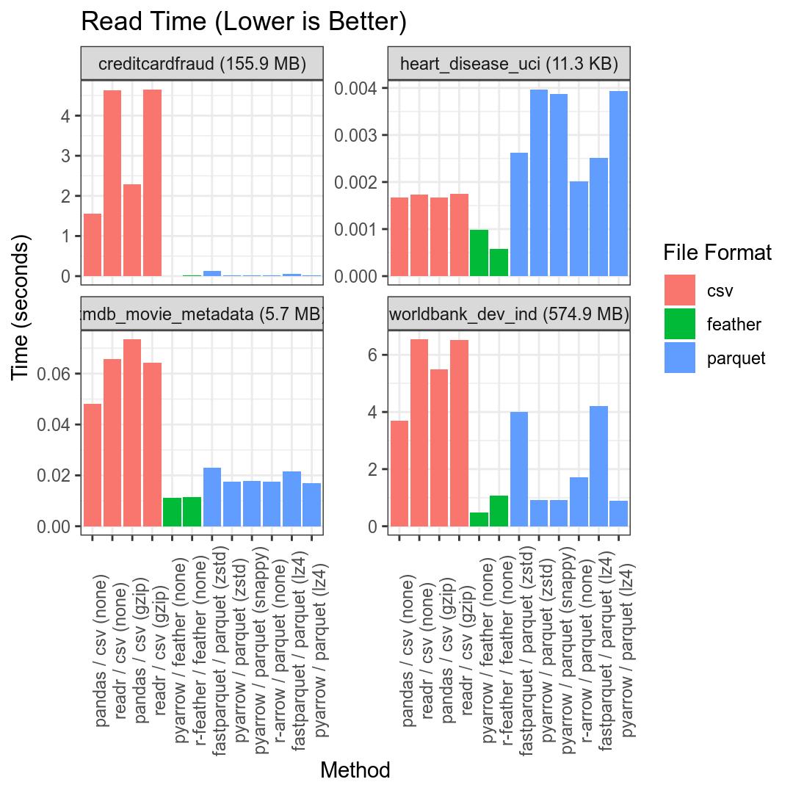
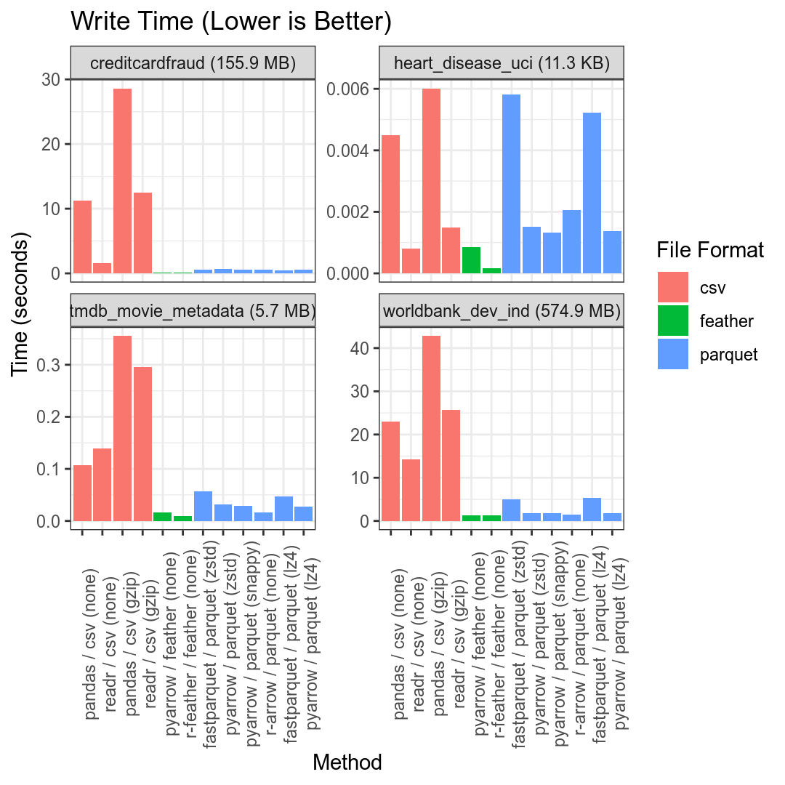
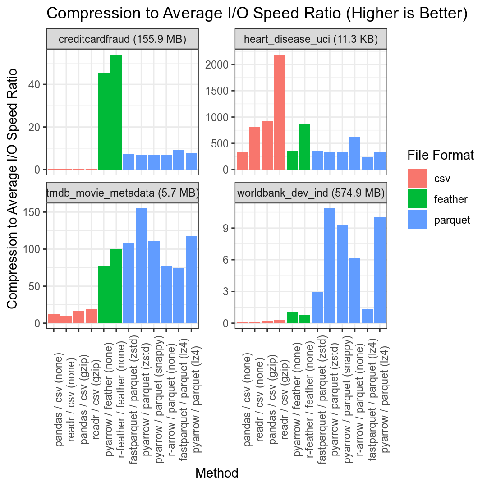

R/Python Data Compression Benchmark Results Summary
================
2020-01-11

``` r
library(tidyverse)
library(knitr)

opts_chunk$set(fig.width = 5.625, fig.height = 5.625, dpi = 192)
```

# Overview

``` r
res <- read_csv('/data/benchmark/compression/timings/all_timings.csv', col_types = cols())

# add a more useful "Method" column and reorder columns
res <- res %>%
  mutate(Method = sprintf("%s / %s (%s)", Library, `File Format`, Compression)) %>%
  select(Dataset, Method, everything())

# convert "Method" field to a factor with the desired order
method_levels <- res %>%
  arrange(`File Format`, desc(Compression), Library) %>%
  pull(Method) %>%
  unique()

res$Method <- factor(res$Method, levels = method_levels)
  
# finally, let's add a fields representing the average compression ratio, and the
# compression ratio to average i/o ratio
data_sizes <- res %>%
  filter(Library == 'pandas' & `File Format` == 'csv' & Compression == 'none') %>%
  select(dataset=Dataset, size=`File Size (MB)`)

res$natural_size <- data_sizes$size[match(res$Dataset, data_sizes$dataset)]

res <- res %>%
  mutate(`Compression Ratio` = natural_size / `File Size (MB)`) %>%
  mutate(`Compression to I/O Ratio` = `Compression Ratio` / (0.5 * (`Read Time (Secs)` + `Write Time (Secs)`)))

# include original dataset sizes in plot sub-headers
label <- sprintf("%s (%0.1f MB)", res$Dataset, res$natural_size)

mask <- res$natural_size < 1
label[mask] <- sprintf("%s (%0.1f KB)", res$Dataset[mask], res$natural_size[mask] * 1e3)

res$Dataset <- label

# split datasets into groups of 4 when plotting
datasets <- unique(res$Dataset)
datasets_list <- split(datasets, ceiling(seq_along(datasets) / 4))
```

# Read Time (seconds)

``` r
for (dataset_subset in datasets_list) {
  res_subset <- res %>%
    filter(Dataset %in% dataset_subset)

  print(ggplot(res_subset, aes(x = Method, y = `Read Time (Secs)`, fill = `File Format`)) +
    geom_bar(stat = 'identity') + 
    facet_wrap(~Dataset, scales = 'free_y') +
    theme_bw() +
    theme(axis.text.x = element_text(angle = 90)) +
    ggtitle("Read Time (Lower is Better)") +
    ylab("Time (seconds)"))
}
```

<!-- --><!-- -->

# Write Time (seconds)

``` r
for (dataset_subset in datasets_list) {
  res_subset <- res %>%
    filter(Dataset %in% dataset_subset)

  print(ggplot(res_subset, aes(x = Method, y = `Write Time (Secs)`, fill = `File Format`)) +
    geom_bar(stat = 'identity') + 
    facet_wrap(~Dataset, scales = 'free_y') +
    theme_bw() +
    theme(axis.text.x = element_text(angle = 90)) +
    ggtitle("Write Time (Lower is Better)") +
    ylab("Time (seconds)"))
}
```

<!-- --><!-- -->

# Filesize (MB)

``` r
for (dataset_subset in datasets_list) {
  res_subset <- res %>%
    filter(Dataset %in% dataset_subset)

  print(ggplot(res_subset, aes(x = Method, y = `File Size (MB)`, fill = `File Format`)) +
    geom_bar(stat = 'identity') + 
    facet_wrap(~Dataset, scales = 'free_y') +
    theme_bw() +
    theme(axis.text.x = element_text(angle = 90)) +
    ggtitle("File Size (Lower is Better)") +
    ylab("Size (MB)"))
}
```

<!-- --><!-- -->

# Compression to Average I/O Speed Ratio

``` r
for (dataset_subset in datasets_list) {
  res_subset <- res %>%
    filter(Dataset %in% dataset_subset)

  print(ggplot(res_subset, aes(x = Method, y = `Compression to I/O Ratio`, fill = `File Format`)) +
    geom_bar(stat = 'identity') + 
    facet_wrap(~Dataset, scales = 'free_y') +
    theme_bw() +
    theme(axis.text.x = element_text(angle = 90)) +
    ggtitle("Compression to Average I/O Speed Ratio (Higher is Better)") +
    ylab("Compression to Average I/O Speed Ratio"))
}
```

<!-- --><!-- -->
